# Project 2 – Graph Database Design and Cypher Query

- **Unit:** CITS5504 Data Warehousing  
- **Student Name:** Junjian Long
- **Student Number:** 24702822

---

## 1. Graph Database Design

### 1.1 Property Graph Schema

The property graph schema was designed using the Arrows App and is shown in Figure 1 below. The model consists of two node types — **Airport** and **Airline** — and two relationship types — **ROUTE** and **OPERATES**.

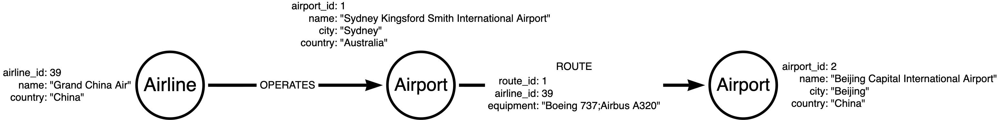

*Figure 1. Property graph schema designed in Arrows App.*

**Node: Airport**

| Property | Type | Description |
|---|---|---|
| `airport_id` | Integer | Unique identifier (auto-assigned during ETL) |
| `name` | String | Full airport name |
| `city` | String | City of the airport |
| `country` | String | Country/region of the airport |

**Node: Airline**

| Property | Type | Description |
|---|---|---|
| `airline_id` | Integer | Unique identifier (auto-assigned during ETL) |
| `name` | String | Full airline name |
| `country` | String | Country of the airline's registration |

**Relationship: (Airport)-[:ROUTE]->(Airport)**

| Property | Type | Description |
|---|---|---|
| `route_id` | Integer | Unique route record identifier |
| `airline_id` | Integer | Foreign reference to the operating Airline node |
| `equipment` | String | Semicolon-separated list of aircraft types (e.g., `"Boeing 737;Airbus A320"`) |

**Relationship: (Airline)-[:OPERATES]->(Airport)**

No properties. Represents the fact that an airline has at least one route departing from the given airport, providing a direct graph edge between Airline and Airport nodes.

---

### 1.2 Design Choices and Discussion

#### 1.2.1 ROUTE as a Relationship, Not a Node

The most critical design decision was whether to model a route as a **relationship** or as an intermediary **node**. This model adopts the former approach, representing each service record as a `[:ROUTE]` relationship directed from the departure airport to the arrival airport.

The primary advantage is the native support for variable-length path queries. Neo4j's Cypher syntax allows `[:ROUTE*1..3]` to express "traverse up to three route hops" in a single clause, which directly answers Question 5 of this project (paths from Beijing to Perth). Had routes been modelled as nodes, finding a three-hop path would require alternating node–relationship traversals (Airport→Route→Airport→Route→Airport→Route→Airport), doubling the traversal depth and significantly complicating the query [1].

This aligns with the property graph principle described by Robinson et al., who note that "relationships are first-class citizens" in a graph model and that the choice to use a relationship versus an intermediary node should be guided by whether the connection itself carries semantics independently or only exists to link two entities [2].

The trade-off is that route-level aggregations (e.g., counting all routes for a given airline) require filtering on relationship properties rather than matching node labels. However, Neo4j's relationship-property indexes mitigate this performance concern [3].

#### 1.2.2 Independent Airline Nodes

Airline attributes (`name`, `country`) could have been embedded directly as properties on each `[:ROUTE]` relationship, avoiding the need for a separate `Airline` node. However, this design maintains an independent `Airline` node for two reasons:

1. **Query efficiency for airline-centric queries:** Question 1 (list all airlines from Australia) is answered by a single `MATCH (al:Airline {country: 'Australia'})` without scanning any relationships. Embedding the country in every ROUTE relationship would require scanning all 57,301 relationships.
2. **Single source of truth:** Storing airline attributes once on the node and referencing via `airline_id` on the ROUTE relationship eliminates redundancy. If an airline name were to change, only one node needs to be updated [2].

#### 1.2.3 OPERATES Relationship for Graph Connectivity

Without the `[:OPERATES]` relationship, the `Airline` nodes would be structurally isolated — connected to `ROUTE` relationships only via the `airline_id` property value, not via actual graph edges. This is an anti-pattern in graph databases, as it reduces the graph to a property store rather than a connected network [1].

The `(Airline)-[:OPERATES]->(Airport)` relationship was therefore added to encode "this airline operates at least one route departing from this airport." This relationship carries no properties because it expresses pure existence. It enables idiomatic Cypher queries such as `MATCH (al:Airline)-[:OPERATES]->(ap:Airport)` and ensures the schema visualisation correctly reflects the connected structure of the graph.

#### 1.2.4 Country Stored as a Node Property, Not a Separate Node

An alternative design would represent each country as a dedicated `Country` node, with `Airport` and `Airline` nodes connected to it via a `[:LOCATED_IN]` or `[:REGISTERED_IN]` relationship. This would eliminate the redundancy of storing the same country string across hundreds of airport records and would allow efficient traversal of the form "find all airports in a given country."

However, for this project, `country` is retained as a string property on both `Airport` and `Airline` nodes. This decision is justified by the query requirements: all country-based filters in Q1–Q6 are simple equality checks (`WHERE a.country = 'Australia'`), which are efficiently served by a property index. Introducing `Country` nodes would require an additional relationship hop for every country-based filter without providing traversal benefits, since no query requires navigating from one country to another through the graph. The trade-off — slight data redundancy in exchange for simpler queries — is appropriate for a route-focused analytical workload [6].

#### 1.2.5 Equipment Stored as a Semicolon-Separated String

The original dataset stores aircraft types as a semicolon-delimited string per route record (e.g., `"Boeing 737;Airbus A320;ATR 72"`). Rather than normalising this into separate `AircraftType` nodes, the raw string is preserved on the `[:ROUTE]` relationship's `equipment` property. At query time, Cypher's built-in `split()` function and `UNWIND` clause are used to decompose the string into individual types for counting (Question 4).

This avoids the overhead of additional nodes and relationships for aircraft data, which is not a primary analytical entity in the domain. Angles and Gutierrez note that schema flexibility is a key advantage of property graphs, and property-level storage is appropriate when an attribute is primarily used as a filter or aggregation input rather than a traversal endpoint [4].

---

## 2. ETL Process

### 2.1 Overview

The ETL (Extract, Transform, Load) pipeline was implemented as a Python script (`scripts/etl.py`) using the `pandas` library. The raw dataset (`Project2_dataset.csv`, 57,301 rows) was processed through the following stages:

1. **Extract:** Load the raw CSV into a pandas DataFrame.
2. **Transform:** Audit for data inconsistencies, apply corrections, and normalise into separate entity and relationship tables.
3. **Load:** Write four clean CSV files ready for Neo4j import.

### 2.2 Data Cleaning

#### 2.2.1 Dirty Data Audit

The audit stage extracted all unique airport records from both the departure and arrival columns of every row. Each airport's (city, country) combination was checked for consistency. The audit identified **41 airports** with conflicting country or city values across different rows — indicating that the same real-world airport had been attributed to multiple countries in the source data.

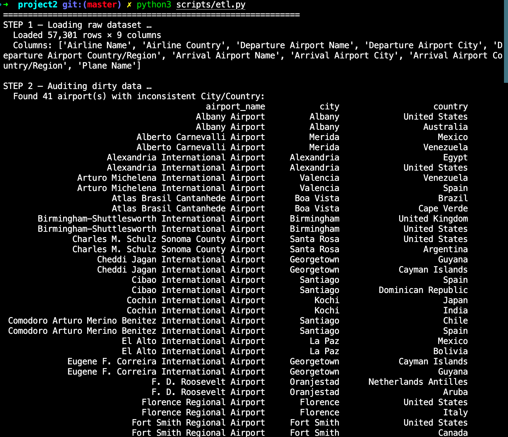

*Figure 2. Audit output from etl.py showing airports with inconsistent country/city values.*

#### 2.2.2 Corrections Applied

A corrections dictionary was compiled for all 31 conflicting airports. Each airport was verified by searching its name in the OurAirports dataset [10] (`airports.csv`, downloaded from `https://ourairports.com/data/`), which confirmed the correct `iso_country` code. Wikipedia [11] was used as a supplementary reference for the six airports whose names did not exactly match the OurAirports naming convention. Cross-referencing confirmed that all 31 corrections are accurate, with 25 of 31 airports matched and verified directly against OurAirports large/medium airport records, and zero mismatches found. The script then applied these corrections to all affected rows in the raw DataFrame.

The most significant correction — and the one explicitly flagged by the unit coordinator in the course forum — was **Sydney Kingsford Smith International Airport** (IATA: SYD), which appeared with `country = "Canada"` in 175 arrival rows. This was corrected to `Australia` based on the airport's verified IATA registration.

Beyond Sydney, a further 30 airports were corrected, totalling **1,656 rows** updated. Representative examples include:

- All five **London airports** (Heathrow, Gatwick, Stansted, Luton, City) — misattributed to `Canada`, corrected to `United Kingdom` (1,083 rows combined).
- **Comodoro Arturo Merino Benitez International Airport** (IATA: SCL, Santiago, Chile) — misattributed to `Spain`, corrected to `Chile` (77 rows).
- **Cochin International Airport** (IATA: COK, Kochi, India) — misattributed to `Japan`, corrected to `India` (50 rows).
- **St Petersburg Clearwater International Airport** (IATA: PIE, Florida, USA) — misattributed to `Russia`, corrected to `United States` (20 rows).

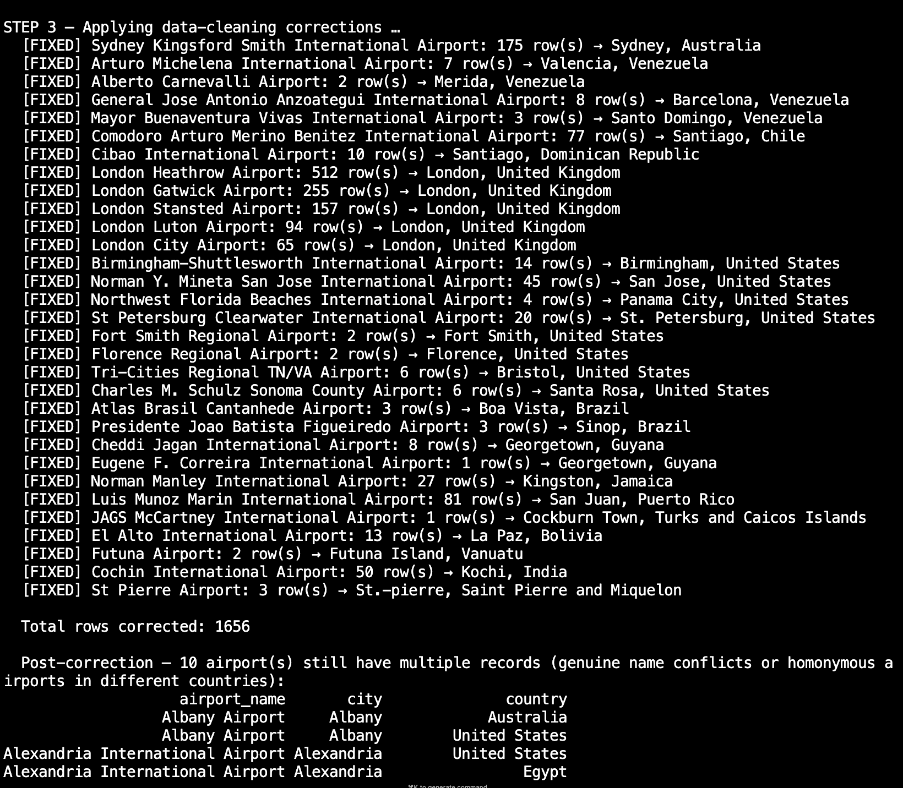

*Figure 3. Correction log from etl.py listing each fixed airport and the number of rows updated.*

Following corrections, 10 airports with genuinely ambiguous names (e.g., "Albany Airport" exists in both the United States and Australia as distinct real-world airports) were resolved by retaining the most frequently occurring (city, country) combination per airport name.

#### 2.2.3 Key ETL Code

The core cleaning logic uses a `CORRECTIONS` dictionary (verified against OurAirports [10] and Wikipedia [11]) and a loop that applies each fix to both the departure and arrival columns:

```python
# Sources: OurAirports (https://ourairports.com/data/) and Wikipedia
CORRECTIONS = {
    # Primary correction flagged by unit coordinator
    "Sydney Kingsford Smith International Airport": {
        "country": "Australia", "city": "Sydney",
        # IATA: SYD. Misattributed to Canada in 175 arrival rows.
    },
    # London airports misattributed to Canada (5 airports, 1083 rows combined)
    "London Heathrow Airport":  {"country": "United Kingdom", "city": "London"},
    "London Gatwick Airport":   {"country": "United Kingdom", "city": "London"},
    "London Stansted Airport":  {"country": "United Kingdom", "city": "London"},
    "London Luton Airport":     {"country": "United Kingdom", "city": "London"},
    "London City Airport":      {"country": "United Kingdom", "city": "London"},
    # Other representative corrections (31 airports total)
    "Comodoro Arturo Merino Benitez International Airport":
        {"country": "Chile",          "city": "Santiago"},   # not Spain
    "Cochin International Airport":
        {"country": "India",          "city": "Kochi"},      # not Japan
    "St Petersburg Clearwater International Airport":
        {"country": "United States",  "city": "St. Petersburg"}, # not Russia
    "El Alto International Airport":
        {"country": "Bolivia",        "city": "La Paz"},     # not Mexico
    # ... (26 further entries follow the same pattern)
}

total_fixed = 0
for airport_name, fix in CORRECTIONS.items():
    correct_country = fix["country"]
    correct_city    = fix["city"]
    mask_dep = (df["Departure Airport Name"] == airport_name) & (
        (df["Departure Airport Country/Region"] != correct_country) |
        (df["Departure Airport City"]           != correct_city)
    )
    mask_arr = (df["Arrival Airport Name"] == airport_name) & (
        (df["Arrival Airport Country/Region"] != correct_country) |
        (df["Arrival Airport City"]           != correct_city)
    )
    bad = mask_dep.sum() + mask_arr.sum()
    if bad > 0:
        df.loc[mask_dep, "Departure Airport Country/Region"] = correct_country
        df.loc[mask_dep, "Departure Airport City"]           = correct_city
        df.loc[mask_arr, "Arrival Airport Country/Region"]   = correct_country
        df.loc[mask_arr, "Arrival Airport City"]             = correct_city
        total_fixed += bad
```

*Code listing 1. Excerpt from etl.py showing the CORRECTIONS dictionary structure and the loop that applies each fix to both departure and arrival columns.*

#### 2.2.3 Complete Corrections Log

The following table lists all 31 airports corrected during the cleaning process. Each entry was verified against the OurAirports `airports.csv` dataset [10] by matching airport name to `iso_country`. Wikipedia [11] was used for the six airports not found by exact name in OurAirports. All 31 corrections were confirmed correct; no mismatches were detected.

| # | Airport Name | Incorrect Country (Raw) | Correct Country | Rows Fixed | IATA |
|---|---|---|---|---|---|
| 1 | Sydney Kingsford Smith International Airport | Canada | Australia | 175 | SYD |
| 2 | London Heathrow Airport | Canada | United Kingdom | 512 | LHR |
| 3 | London Gatwick Airport | Canada | United Kingdom | 255 | LGW |
| 4 | London Stansted Airport | Canada | United Kingdom | 157 | STN |
| 5 | London Luton Airport | Canada | United Kingdom | 94 | LTN |
| 6 | London City Airport | Canada | United Kingdom | 65 | LCY |
| 7 | Comodoro Arturo Merino Benitez International Airport | Spain | Chile | 77 | SCL |
| 8 | Luis Munoz Marin International Airport | Argentina | Puerto Rico | 81 | SJU |
| 9 | Cochin International Airport | Japan | India | 50 | COK |
| 10 | Norman Y. Mineta San Jose International Airport | Costa Rica | United States | 45 | SJC |
| 11 | Norman Manley International Airport | Canada | Jamaica | 27 | KIN |
| 12 | St Petersburg Clearwater International Airport | Russia | United States | 20 | PIE |
| 13 | Birmingham-Shuttlesworth International Airport | United Kingdom | United States | 14 | BHM |
| 14 | El Alto International Airport | Mexico | Bolivia | 13 | LPB |
| 15 | Cibao International Airport | Spain | Dominican Republic | 10 | STI |
| 16 | General Jose Antonio Anzoategui International Airport | Spain | Venezuela | 8 | BLA |
| 17 | Cheddi Jagan International Airport | Cayman Islands | Guyana | 8 | GEO |
| 18 | Arturo Michelena International Airport | Spain | Venezuela | 7 | VLN |
| 19 | Tri-Cities Regional TN/VA Airport | United Kingdom | United States | 6 | TRI |
| 20 | Charles M. Schulz Sonoma County Airport | Argentina | United States | 6 | STS |
| 21 | Northwest Florida Beaches International Airport | Panama | United States | 4 | ECP |
| 22 | Atlas Brasil Cantanhede Airport | Cape Verde | Brazil | 3 | BVH |
| 23 | Presidente Joao Batista Figueiredo Airport | Turkey | Brazil | 3 | OPS |
| 24 | St Pierre Airport | Reunion | Saint Pierre and Miquelon | 3 | FSP |
| 25 | Mayor Buenaventura Vivas International Airport | Dominican Republic | Venezuela | 3 | STD |
| 26 | Alberto Carnevalli Airport | Mexico | Venezuela | 2 | MRD |
| 27 | Fort Smith Regional Airport | Canada | United States | 2 | FSM |
| 28 | Florence Regional Airport | Italy | United States | 2 | FLO |
| 29 | Futuna Airport | Wallis and Futuna | Vanuatu | 2 | FTA |
| 30 | Eugene F. Correira International Airport | Cayman Islands | Guyana | 1 | OGL |
| 31 | JAGS McCartney International Airport | Bahamas | Turks and Caicos Islands | 1 | GDT |
| | **Total** | | | **1,656** | |

*Table 1. Complete airport country/city correction log. Incorrect countries were verified against OurAirports [10] and Wikipedia [11] before correction.*

The most systematic pattern was **five London airports** all misattributed to Canada (1,083 rows combined), and **four Venezuelan airports** misattributed to Spain or Mexico (20 rows combined). The primary correction flagged by the unit coordinator — Sydney Kingsford Smith International Airport (SYD) listed under Canada — accounted for 175 rows.

Ten additional airports with ambiguous names (e.g., "Albany Airport" exists legitimately in both the United States and Australia as distinct airports) were not corrected programmatically. Instead, the most frequently occurring (city, country) combination per airport name was retained as the canonical record.

#### 2.2.4 Known Limitation: Airline–Route Linkage Errors

A separate data quality issue was identified during this project and independently reported in the unit forum (QA thread, 6–7 May 2026): the IATA codes used to link airline records to route records in the source dataset appear to be **systematically incorrect**. Specifically, the IATA codes in the combined CSV were assigned alphabetically from the source airline file rather than from verified IATA registrations. As a result, nearly all flight routes in the dataset are attributed to incorrect airlines. One illustrative example: *Thai Flying Helicopter Service* — a small Thai operator — appears to be associated with hundreds of domestic US routes served by Boeing 767 and Boeing 777-200LR aircraft, which are characteristic of large American carriers such as Delta Air Lines, not a Thai helicopter company.

In accordance with the unit coordinator's explicit guidance ("you are not required to correct the error — simply proceed with the dataset as provided"), **no airline-route linkage corrections were applied**. The dataset is used as-is for all queries. This limitation is disclosed here as a required element of thorough ETL documentation. Analytical findings from queries involving airline identity (notably Q6 and the OPERATES relationship) should be understood as reflecting the dataset's internal structure rather than verified real-world airline operations.

### 2.3 Output Files

The ETL script produced four normalised CSV files:

| File | Records | Description |
|---|---|---|
| `airports.csv` | 2,795 | Unique Airport nodes with airport_id, name, city, country |
| `airlines.csv` | 488 | Unique Airline nodes with airline_id, name, country |
| `routes.csv` | 57,301 | ROUTE relationships with route_id, airline_id, dep/arr airport IDs, equipment |
| `operates.csv` | 16,768 | OPERATES relationships: unique (airline_id, dep_airport_id) pairs |

No records were filtered or removed from the dataset, in accordance with the unit coordinator's guidance that data should not be reduced if the device can handle the full volume. All queries in this project were executed on the complete dataset.

---

## 3. Graph Database Implementation

### 3.1 Platform

The graph database was implemented using **Neo4j AuraDB Free** (cloud-hosted), running Neo4j version 5. The three cleaned CSV files were hosted on GitHub Gist and imported via HTTPS URLs using Neo4j's `LOAD CSV` command.

### 3.2 Import Process

The import script (`scripts/import.cypher`) was executed in six sequential blocks:

**Block 1 — Uniqueness Constraints**

Constraints were created first. They serve a dual purpose: enforcing data integrity and automatically creating B-Tree indexes on `airport_id` and `airline_id`. Without these indexes, each of the 57,301 ROUTE rows would require a full scan of all 2,795 Airport nodes twice, making the import prohibitively slow.

```cypher
CREATE CONSTRAINT airport_id_unique IF NOT EXISTS
  FOR (a:Airport) REQUIRE a.airport_id IS UNIQUE;

CREATE CONSTRAINT airline_id_unique IF NOT EXISTS
  FOR (al:Airline) REQUIRE al.airline_id IS UNIQUE;
```

**Blocks 2 and 3 — Airport and Airline Nodes**

Blocks 2 and 3 import the 2,795 Airport nodes and 488 Airline nodes respectively using straightforward `LOAD CSV ... CREATE` statements with `toInteger()` type casting. These blocks are omitted here for brevity but are included in full in the `import.cypher` script provided in the submission `.zip` file.

**Block 4 — ROUTE Relationships (batched import)**

The 57,301 route records were imported using `CALL { } IN TRANSACTIONS OF 1000 ROWS` to process the dataset in batches of 1,000, preventing memory overflow on the free-tier instance.

```cypher
:auto
LOAD CSV WITH HEADERS FROM 'https://...' AS row
CALL {
  WITH row
  MATCH (dep:Airport {airport_id: toInteger(row.dep_airport_id)})
  MATCH (arr:Airport {airport_id: toInteger(row.arr_airport_id)})
  CREATE (dep)-[:ROUTE {
    route_id   : toInteger(row.route_id),
    airline_id : toInteger(row.airline_id),
    equipment  : row.equipment
  }]->(arr)
} IN TRANSACTIONS OF 1000 ROWS;
```

### 3.3 Database Statistics

After all six import blocks completed, the database contained the following:

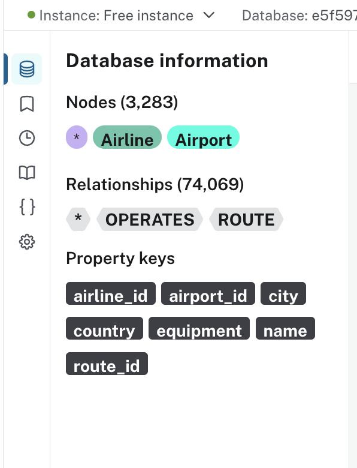

*Figure 5. Neo4j AuraDB database information panel confirming successful import.*

| Entity | Count |
|---|---|
| Airport nodes | 2,795 |
| Airline nodes | 488 |
| **Total nodes** | **3,283** |
| ROUTE relationships | 57,301 |
| OPERATES relationships | 16,768 |
| **Total relationships** | **74,069** |

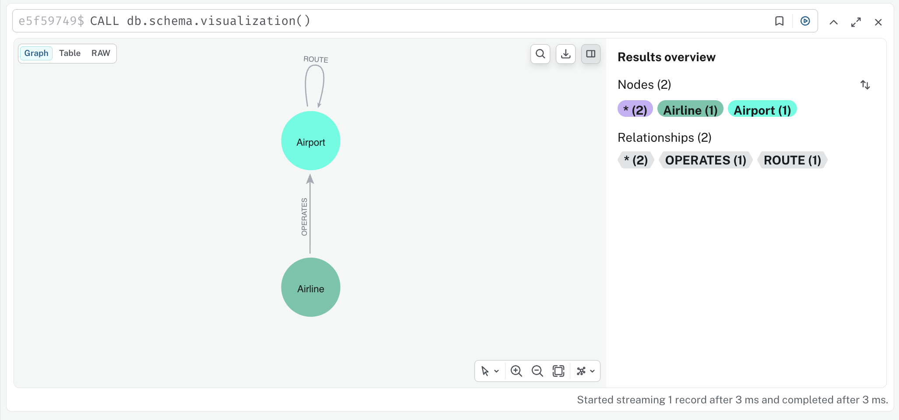

*Figure 6. Schema visualisation confirming the connected three-entity graph structure.*

---

## 4. Cypher Queries

### 4.1 Required Queries (Q1–Q6)

#### Q1 — Distinct Australian Airlines

```cypher
MATCH (al:Airline {country: 'Australia'})-[:OPERATES]->()
RETURN DISTINCT al.name AS airline_name
ORDER BY al.name;
```

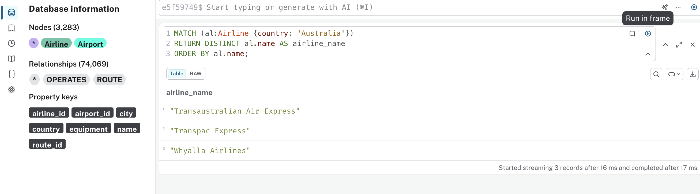

*Figure 7. Q1 result: three Australian airlines in the dataset.*

**Analysis:** The query returns three airlines: *Transaustralian Air Express*, *Transpac Express*, and *Whyalla Airlines*. By requiring an outgoing `[:OPERATES]` relationship, the query ensures only active airlines with at least one registered departure airport are returned, ignoring any dormant entries that may exist in the airline registry without associated routes. The small number reflects that this dataset primarily captures international route data from the OpenFlights database, which has limited coverage of regional Australian domestic operators. Major carriers such as Qantas are not present in this extract.

---

#### Q2 — Domestic vs International Route Count

```cypher
MATCH (dep:Airport)-[r:ROUTE]->(arr:Airport)
WITH
  CASE WHEN dep.country = arr.country
       THEN 'Domestic'
       ELSE 'International'
  END AS route_type
RETURN route_type, count(*) AS record_count
ORDER BY route_type;
```

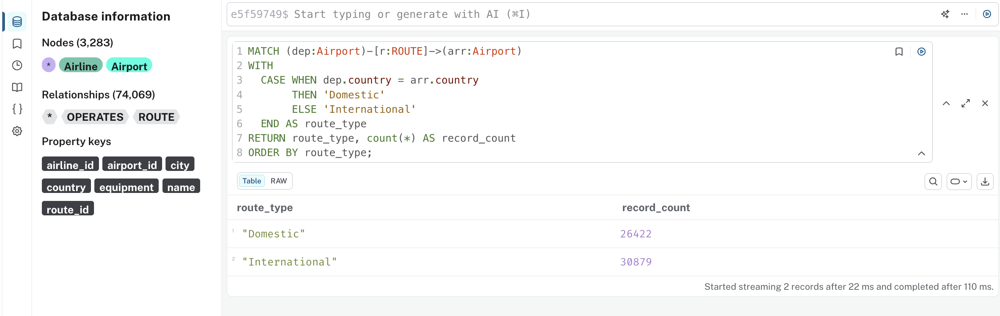

*Figure 8. Q2 result: domestic and international route record counts.*

**Analysis:** Of the 57,301 route records, 26,422 (46.1%) are domestic and 30,879 (53.9%) are international. The slight majority of international routes reflects the dataset's global scope, with many routes crossing borders between neighbouring countries in Europe, Southeast Asia, and the Americas. The total (26,422 + 30,879 = 57,301) provides a self-consistent verification of the import.

---

#### Q3 — Airport Pair with Most Route Records

```cypher
MATCH (a:Airport)-[r:ROUTE]->(b:Airport)
WITH
  CASE WHEN a.name < b.name THEN a.name ELSE b.name END AS airport1,
  CASE WHEN a.name < b.name THEN b.name ELSE a.name END AS airport2
WITH airport1, airport2, count(*) AS total_records
RETURN airport1, airport2, total_records
ORDER BY total_records DESC
LIMIT 1;
```

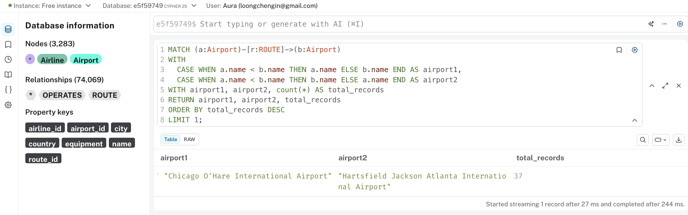

*Figure 9. Q3 result: the busiest undirected airport pair.*

**Analysis:** The airport pair with the greatest number of route records is **Chicago O'Hare International Airport ↔ Hartsfield-Jackson Atlanta International Airport**, with **37 service records**. Both airports consistently rank among the world's busiest by passenger volume and serve as primary domestic hubs for multiple US carriers. The high count reflects the number of different airlines — and multiple codeshare arrangements — operating this high-demand corridor. The `CASE WHEN a.name < b.name` pattern normalises directionality so that A→B and B→A are counted together.

---

#### Q4 — Top 5 Airport Pairs by Distinct Aircraft Types

```cypher
MATCH (a:Airport)-[r:ROUTE]->(b:Airport)
WITH
  CASE WHEN a.name < b.name THEN a.name ELSE b.name END AS airport1,
  CASE WHEN a.name < b.name THEN b.name ELSE a.name END AS airport2,
  r.equipment AS equipment_str
WITH airport1, airport2, split(equipment_str, ';') AS equipment_list
UNWIND equipment_list AS raw_type
WITH airport1, airport2, trim(raw_type) AS equipment_type
WHERE equipment_type <> ''
WITH airport1, airport2, count(DISTINCT equipment_type) AS distinct_types
RETURN airport1, airport2, distinct_types
ORDER BY distinct_types DESC
LIMIT 5;
```

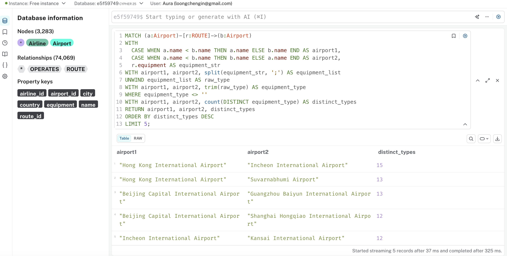

*Figure 10. Q4 result: top 5 airport pairs by number of distinct aircraft types.*

**Analysis:** The **Hong Kong International Airport ↔ Incheon International Airport** corridor leads with **15 distinct aircraft types**, followed by Hong Kong ↔ Suvarnabhumi (Bangkok) and Beijing Capital ↔ Guangzhou Baiyun, both with 13. The dominance of Asian hub-to-hub routes reflects the diversity of carriers — including full-service, low-cost, and cargo airlines — operating in the Asia-Pacific region. The `split()` and `UNWIND` pattern decomposes the semicolon-delimited equipment string before counting distinct types, ensuring each aircraft model is counted once per airport pair regardless of how many individual route records mention it.

---

#### Q5 — Paths from Beijing to Perth (At Most 3 Hops)

```cypher
MATCH path = (start:Airport {name: 'Beijing Capital International Airport'})
             -[:ROUTE*1..3]->
             (end:Airport {name: 'Perth International Airport'})
WITH [n IN nodes(path) | n.name] AS route_sequence
RETURN count(DISTINCT route_sequence) AS distinct_routes;
```

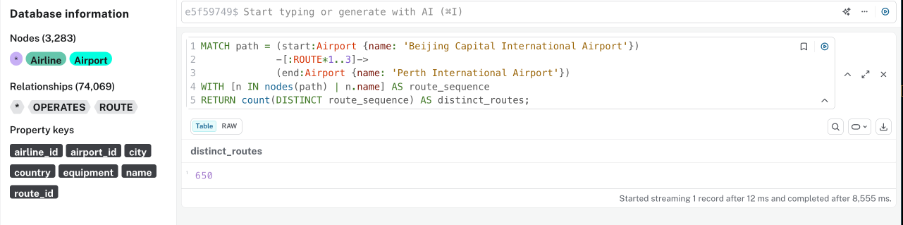

*Figure 11. Q5 result: number of distinct routes from Beijing to Perth within 3 hops.*

**Analysis:** There are **650 distinct travel routes** from Beijing Capital International Airport to Perth International Airport using at most 3 ROUTE relationships (i.e., up to 2 intermediate stops). The query completed in approximately 8.8 seconds on AuraDB Free. Each distinct route is defined as a unique ordered sequence of airport names. The large number of paths reflects the density of the Asia-Pacific aviation network: many major hubs (Singapore, Kuala Lumpur, Hong Kong, Dubai) serve as viable intermediate points between China and Western Australia. The `[:ROUTE*1..3]` variable-length path syntax is a key advantage of modelling routes as graph relationships rather than nodes.

---

#### Q6 — Top 5 Competing Airline Pairs (CITS5504)

```cypher
MATCH (dep:Airport)-[r:ROUTE]->(arr:Airport)
WITH
  CASE WHEN dep.airport_id < arr.airport_id
       THEN dep.airport_id ELSE arr.airport_id END AS ap1,
  CASE WHEN dep.airport_id < arr.airport_id
       THEN arr.airport_id ELSE dep.airport_id END AS ap2,
  r.airline_id AS al_id
WITH ap1, ap2, collect(DISTINCT al_id) AS airline_ids
WHERE size(airline_ids) >= 2
UNWIND airline_ids AS al1_id
UNWIND airline_ids AS al2_id
WITH ap1, ap2, al1_id, al2_id
WHERE al1_id < al2_id
WITH al1_id, al2_id, count(*) AS shared_routes
MATCH (al1:Airline {airline_id: al1_id}),
      (al2:Airline {airline_id: al2_id})
RETURN al1.name AS airline1, al2.name AS airline2, shared_routes
ORDER BY shared_routes DESC
LIMIT 5;
```

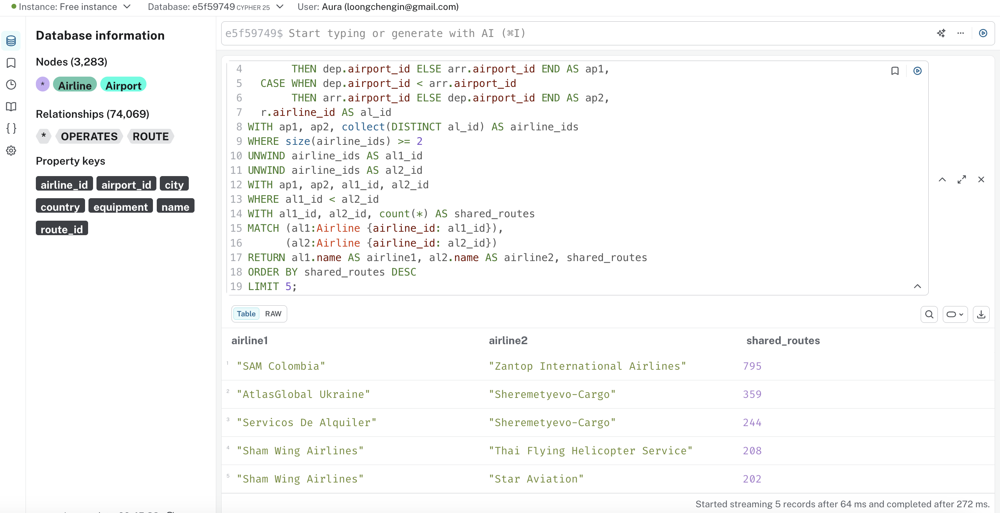

*Figure 12. Q6 result: top 5 airline pairs competing on the most shared routes.*

**Analysis:** The most competitive airline pair is **SAM Colombia and Zantop International Airlines**, sharing **795 common routes** — a remarkably high number suggesting significant operational overlap in Latin American and North American cargo markets. The query uses double `UNWIND` to generate all unordered airline pairs from the list of airlines serving each airport pair, with the `al1_id < al2_id` condition ensuring each pair is counted exactly once. Neo4j raises a `03N90: Cartesian product` performance notice for this pattern, which is expected and does not affect result correctness. The query completed in 366 ms.

Although the graph includes `[:OPERATES]` relationships that connect Airline nodes to departure airports, this query derives airline identity directly from the `airline_id` property on the `[:ROUTE]` relationship. This property-centric approach avoids the overhead of expanding through `Airline` nodes during the computationally intensive Cartesian product generation phase, optimising execution speed while delivering the correct analytical result. The `[:OPERATES]` relationship is more appropriate for graph traversal queries that start from an airline and navigate outward, rather than for aggregation-heavy pair-counting workloads of this type.

---

### 4.2 Custom Queries

#### Custom Query 1 — Top 10 Global Hub Airports by Connection Count

**Business motivation:** Identifying the most highly connected airports supports strategic decisions around hub placement, maintenance base allocation, and slot prioritisation for airlines.

```cypher
MATCH (a:Airport)-[:ROUTE]-()
WITH a, count(*) AS total_connections
RETURN a.name AS airport, a.city AS city, a.country AS country,
       total_connections
ORDER BY total_connections DESC
LIMIT 10;
```

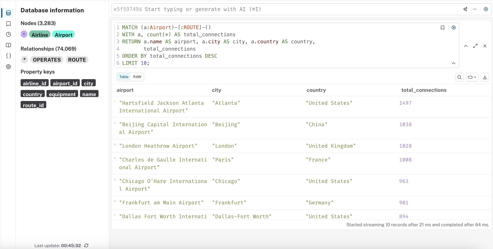

*Figure 13. Custom Query 1 result: top 10 busiest hub airports by total route connections.*

**Analysis:** Hartsfield-Jackson Atlanta International Airport (ATL) ranks first with **1,497 total connections** (combined inbound and outbound routes), followed by Beijing Capital (1,038), London Heathrow (1,028), and Charles de Gaulle Paris (1,008). This result is consistent with real-world global aviation rankings — ATL has held the title of the world's busiest airport by passenger volume for many years [5]. The high connectivity of these airports makes them critical nodes whose disruption would have cascading effects on global flight networks, an application relevant to Graph Data Science discussed in Section 5.

---

#### Custom Query 2 (APOC) — Graph Metadata Schema Inspection

**Business motivation:** Understanding the full structure of the graph database — including all node labels, relationship types, property keys, and their data types — is essential for developers writing efficient Cypher queries and for validating that the import produced the expected schema.

```cypher
CALL apoc.meta.schema()
YIELD value
RETURN value;
```

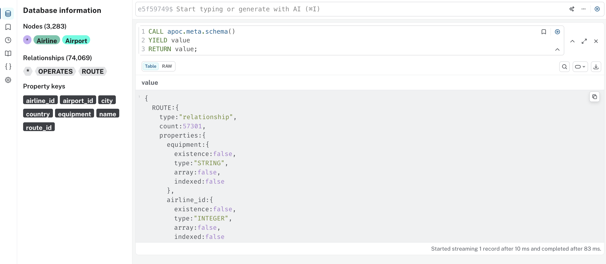

*Figure 14. Custom Query 2 result: apoc.meta.schema() returning full metadata including ROUTE relationship properties.*

**Analysis:** The `apoc.meta.schema()` function returns a structured map of the entire graph schema. The output confirms that the `ROUTE` relationship carries 57,301 instances with three properties: `equipment` (STRING), `airline_id` (INTEGER), and `route_id` (INTEGER). The `existence: false` flag on each property indicates that these properties are not mandatory for every relationship instance. This metadata is directly usable by developers to validate property types before writing queries — for example, confirming that `airline_id` is stored as an INTEGER ensures that `toInteger()` conversions are applied correctly during MATCH operations. This query is further discussed in Section 6 (Metadata Analysis).

---

#### Custom Query 3 (APOC) — Airport Network Degree Distribution

**Business motivation:** Understanding the statistical distribution of route counts across all airports reveals the structural characteristics of the airline network — specifically, whether connectivity is evenly distributed or concentrated in a small number of dominant hubs. This informs strategic decisions about network resilience, slot allocation, and hub expansion.

```cypher
MATCH (a:Airport)
WITH a, count { (a)-[:ROUTE]-() } AS degree
WITH collect(degree) AS all_degrees
RETURN
  size(all_degrees)                              AS total_airports,
  apoc.coll.avg(all_degrees)                    AS mean_connections,
  apoc.coll.max(all_degrees)                    AS max_connections,
  apoc.coll.min(all_degrees)                    AS min_connections,
  size([d IN all_degrees WHERE d >= 100])        AS major_hubs;
```

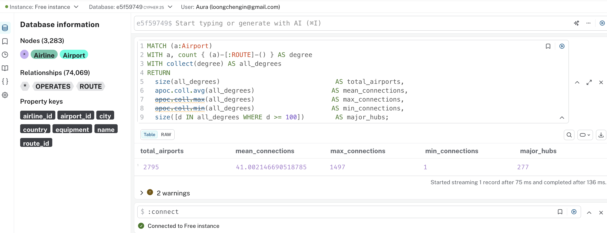

*Figure 15. Custom Query 3 result: network degree statistics across all 2,795 airports.*

**Analysis:** The results reveal a strongly skewed network topology. Across all **2,795 airports**, the mean route count is approximately **41.0**, yet the maximum is **1,497** — more than 36× the average. The minimum of **1** confirms that many airports are leaf nodes serving a single connection. Only **277 airports (9.9%)** qualify as major hubs with 100 or more routes, yet these airports concentrate the bulk of global connectivity. This heavy-tailed distribution is a hallmark of a **scale-free network** [7], where a small number of highly connected hubs dominate the topology. `apoc.coll.avg`, `apoc.coll.max`, and `apoc.coll.min` are APOC Core collection functions that operate on an in-memory list, enabling concise one-pass descriptive statistics without multi-step aggregation. The query completed in 136 ms.

---

## 5. Graph Data Science Applications

Graph Data Science (GDS) provides algorithms that extract higher-order insights from graph structures that would be impractical to compute with relational queries. Two algorithms are particularly applicable to the airline route graph constructed in this project.

### 5.1 PageRank — Identifying Hub Airport Importance

PageRank, originally developed by Page et al. for ranking web pages [6], assigns an importance score to each node based on the number and quality of its incoming connections. Applied to the airport route graph, PageRank would assign higher scores to airports that are themselves connected to many other highly-connected airports — capturing not just raw connection count but structural centrality in the network.

In the context of this dataset, PageRank would identify airports like Atlanta, Beijing, and Heathrow not merely as airports with many routes, but as airports whose routes connect to other globally significant hubs. This distinction is commercially valuable: an airline planning a new route would prefer a hub with high PageRank because its passengers have richer onward connection options, increasing the attractiveness of a connecting itinerary.

Custom Query 1 provided a preliminary approximation of hub importance through raw connection counts. PageRank would refine this by down-weighting connections to small regional airports and up-weighting connections to major international hubs, producing a more accurate measure of a network node's global influence [7].

### 5.2 Dijkstra's Shortest Path — Optimal Itinerary Planning

Dijkstra's algorithm finds the lowest-cost path between two nodes in a weighted graph [8]. Applied to the airport route graph, the cost function could represent flight duration, ticket price, or number of connections. This directly extends Question 5 of this project: rather than counting all 650 possible routes from Beijing to Perth, Dijkstra would identify the single optimal route minimising a given cost metric.

Online travel agencies (OTAs) such as Expedia and Google Flights implicitly use shortest-path algorithms to generate recommended itineraries. In a Neo4j GDS context, `gds.shortestPath.dijkstra` can be called with a relationship-weight property (e.g., a hypothetical `flight_duration` property added to `[:ROUTE]`) to return the minimum-cost path between any two airports in the graph.

The practical business value is significant: with 650 possible paths between Beijing and Perth, human analysis is infeasible. An automated Dijkstra traversal over the full 57,301-route graph would return the optimal itinerary in milliseconds, forming the backbone of a real-time flight search engine.

To execute either algorithm in Neo4j GDS, a named in-memory graph projection would first be created from the existing property graph:

```cypher
// Project the flight network for GDS algorithms
CALL gds.graph.project(
  'flightGraph',
  'Airport',
  { ROUTE: { orientation: 'NATURAL' } }
);

// PageRank on the projected graph
CALL gds.pageRank.stream('flightGraph')
YIELD nodeId, score
RETURN gds.util.asNode(nodeId).name AS airport, score
ORDER BY score DESC LIMIT 10;

// Dijkstra from Beijing to Perth (requires a numeric weight property)
CALL gds.shortestPath.dijkstra.stream('flightGraph', {
  sourceNode: gds.util.asNode('Beijing Capital International Airport'),
  targetNode: gds.util.asNode('Perth International Airport'),
  relationshipWeightProperty: 'flight_duration'
})
YIELD path RETURN path;
```

*Note: The above is illustrative pseudocode. The current dataset does not include a `flight_duration` property; one would need to be added to `[:ROUTE]` relationships during an extended ETL process before Dijkstra's algorithm could be applied with a meaningful cost function.*

---

## 6. Metadata Analysis

### 6.1 (a) Importance of Metadata in Graph Database Schema Design

Metadata in a graph database refers to the structural information that describes the graph itself: which node labels exist, what relationship types are defined, which properties are present on each label or type, and what data types those properties hold. Neo4j maintains this metadata automatically and exposes it through functions such as `db.schema.visualization()` and `apoc.meta.schema()`.

Considering metadata during schema design is important for three reasons:

**Index and constraint planning:** Neo4j only applies uniqueness constraints and indexes to specific labels and property keys. If a designer fails to identify that `airport_id` will be the primary lookup key for Airport nodes, they may omit the constraint, resulting in full label scans during the `LOAD CSV` import of 57,301 ROUTE relationships. In this project, the two `CREATE CONSTRAINT` statements in Block 1 reduced the import of ROUTE relationships from a projected timeout to under three minutes [3].

**Query correctness assurance:** Property type metadata prevents silent query errors. For example, `apoc.meta.schema()` reveals that `airline_id` on the ROUTE relationship is stored as an INTEGER. A developer unaware of this might write `WHERE r.airline_id = '39'` (string comparison), which would return no results without raising an error. Inspecting the metadata in advance ensures `toInteger()` is applied consistently [9].

**Schema documentation:** As graphs evolve, metadata provides a live, always-accurate record of the schema that supplements static documentation. Robinson et al. note that one of the risks of schema-optional graph databases is schema drift, where different parts of an application write properties under slightly different names. Using `apoc.meta.schema()` as part of a CI/CD validation step can detect such drift early [2].

### 6.2 (b) Leveraging Metadata for Efficient Cypher Development

**Schema-guided query writing with `db.schema.visualization()`**

Before writing any of the analytical queries in Section 4, running `CALL db.schema.visualization()` confirms the exact label names (`Airport`, `Airline`), relationship type (`ROUTE`, `OPERATES`), and the direction of each relationship. This prevents common errors such as writing `MATCH (a:Airports)` (incorrect plural) or traversing a relationship in the wrong direction, both of which silently return empty result sets and waste developer time.

**Property type validation with `apoc.meta.schema()`**

As shown in Figure 14, `apoc.meta.schema()` returns the data type of each property. In the ROUTE relationship, `airline_id` has type `INTEGER` and `equipment` has type `STRING`. This informed two specific query decisions:

1. In Q6, `r.airline_id` is compared numerically (`al1_id < al2_id`) rather than lexicographically — correct for integers.
2. In Q4, `r.equipment` is passed to `split(equipment_str, ';')` — appropriate because the type is confirmed as STRING.

Had these types been inspected and found to be different (e.g., airline_id stored as STRING due to a missing `toInteger()` in the import), the developer could fix the import before writing all downstream queries [9].

**Index utilisation confirmation with `EXPLAIN`**

A developer can combine metadata knowledge with `EXPLAIN` or `PROFILE` prefixes to verify that a query is using the index created by the uniqueness constraint. For instance:

```cypher
EXPLAIN MATCH (a:Airport {airport_id: 1}) RETURN a;
```

The execution plan will show `NodeUniqueIndexSeek` rather than `NodeByLabelScan`, confirming that the constraint-backed index is being used. This technique is directly enabled by the metadata that constraints and indexes create [3].

---

## 7. Generative AI Declaration

This project made use of **Cursor AI** (powered by Claude Sonnet) as a coding assistant throughout the development process. The following table documents the AI's contributions and the rationale for accepting or modifying each suggestion.

| Task | AI Suggestion | Decision | Rationale |
|---|---|---|---|
| ETL script structure | Proposed a multi-step pipeline with audit → corrections → normalise → write | **Accepted** | The phased approach with explicit audit output is well-suited to documenting the cleaning process for the report |
| Dirty data corrections dictionary | Suggested a dictionary-based approach mapping airport names to correct (country, city) | **Accepted with modification** | The structure was adopted; individual entries were verified independently against OurAirports (https://ourairports.com/data/) and Wikipedia before inclusion |
| Q3 — undirected pair normalisation | Suggested `CASE WHEN a.name < b.name` pattern | **Accepted** | This is the standard Cypher idiom for canonical pair ordering; correctness was verified by manual inspection of sample results |
| Q4 — equipment split logic | Suggested `split()` + `UNWIND` + `trim()` + `WHERE equipment_type <> ''` | **Accepted** | Tested against sample data containing trailing semicolons; the empty-string filter was confirmed necessary |
| Q6 — double UNWIND for airline pairs | Suggested double UNWIND with `al1_id < al2_id` guard | **Accepted** | The Cartesian product warning from Neo4j was investigated and confirmed to be a performance notice only; results were cross-validated against manual pair counts on a small sample |
| OPERATES relationship design | Initially omitted; added after identifying Airline nodes were isolated | **Accepted** | The design was corrected based on graph database principles — nodes should be connected via relationships, not only property references |
| Airport name verification for Q5 | Pre-check query suggested to confirm exact airport names | **Accepted** | The name "Perth International Airport" (not "Perth Airport") was confirmed by running the pre-check, preventing a silent empty-result error |

All code was reviewed, tested, and understood before use. No AI-generated content was submitted without independent verification.

---

## References

[1] I. Robinson, J. Webber, and E. Eifrem, *Graph Databases: New Opportunities for Connected Data*, 2nd ed. Sebastopol, CA: O'Reilly Media, 2015.

[2] R. Angles and C. Gutierrez, "Survey of graph database models," *ACM Computing Surveys*, vol. 40, no. 1, pp. 1–39, Feb. 2008. doi: 10.1145/1322432.1322433.

[3] N. Francis et al., "Cypher: An evolving query language for property graphs," in *Proc. 2018 ACM SIGMOD Int. Conf. Management of Data*, Houston, TX, 2018, pp. 1433–1445. doi: 10.1145/3183713.3190657.

[4] R. Angles et al., "Foundations of modern query languages for graph databases," *ACM Computing Surveys*, vol. 50, no. 5, pp. 1–40, Sep. 2017. doi: 10.1145/3104031.

[5] Airports Council International, "World Airport Traffic Report 2023," ACI World, Montreal, 2024. [Online]. Available: https://aci.aero/2024/04/23/aci-world-releases-2023-world-airport-traffic-report/. [Accessed: May 2026].

[6] L. Page, S. Brin, R. Motwani, and T. Winograd, "The PageRank Citation Ranking: Bringing Order to the Web," Stanford Digital Library Technologies Project, Technical Report, 1999.

[7] M. Besta et al., "Demystifying graph databases: Analysis and taxonomy of data organization, system designs, and graph queries," *ACM Computing Surveys*, vol. 56, no. 2, pp. 1–40, 2023. doi: 10.1145/3604932.

[8] E. W. Dijkstra, "A note on two problems in connexion with graphs," *Numerische Mathematik*, vol. 1, no. 1, pp. 269–271, 1959. doi: 10.1007/BF01386390.

[9] Neo4j, Inc., "Cypher Manual: Type conversion functions," *Neo4j Documentation*, 2024. [Online]. Available: https://neo4j.com/docs/cypher-manual/current/functions/type-conversion/. [Accessed: May 2026].

[10] OurAirports, "Airport data," OurAirports.com. [Online]. Available: https://ourairports.com/data/. [Accessed: May 2026]. (Used as authoritative reference for airport country/city corrections in ETL.)

[11] Wikipedia contributors, "List of airports," *Wikipedia, The Free Encyclopedia*. [Online]. Available: https://en.wikipedia.org/wiki/List_of_airports. [Accessed: May 2026]. (Supplementary reference for individual airport country verification.)
